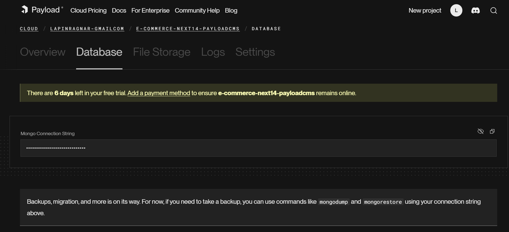
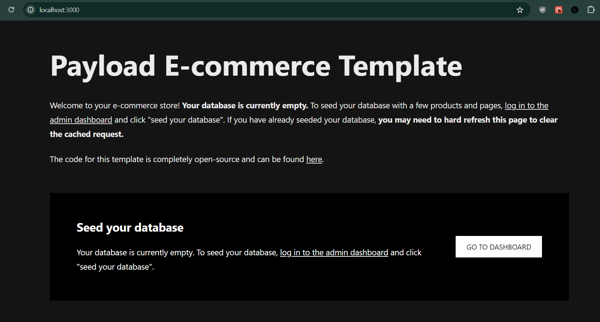

on cree d'abord un projet sur le site de payload cms

# configuration du projet

-installation du projet

```cmd
 npm install --legacy-peer-deps
```

- copier le .env.example en .env
- recuper le variable d'environnement (mongodb string) de la database sur le site de playload:



et on le copie dans le .env dans DATABASE_URI=<le mongodb string>

- ensuite PAYLOAD_SECRET=YOUR_SECRET_HERE (c'est moi qui choisit le secret que je veux)

- on lance npm run dev pour verifier si tout marche
- localhost:3000
et on obient ca :


- on va dans go to dashboard et on cree l'admin utilisateur
- on suit ensuite ce qui est ecrit, on clique sur seed database
- et voila, tout marche!

maintenant il faut configurer le site à notre sauce.

# configuration css
voir le code sur github


# le tuto
https://www.youtube.com/watch?v=3JUsg-WsU9o&t=1521s


